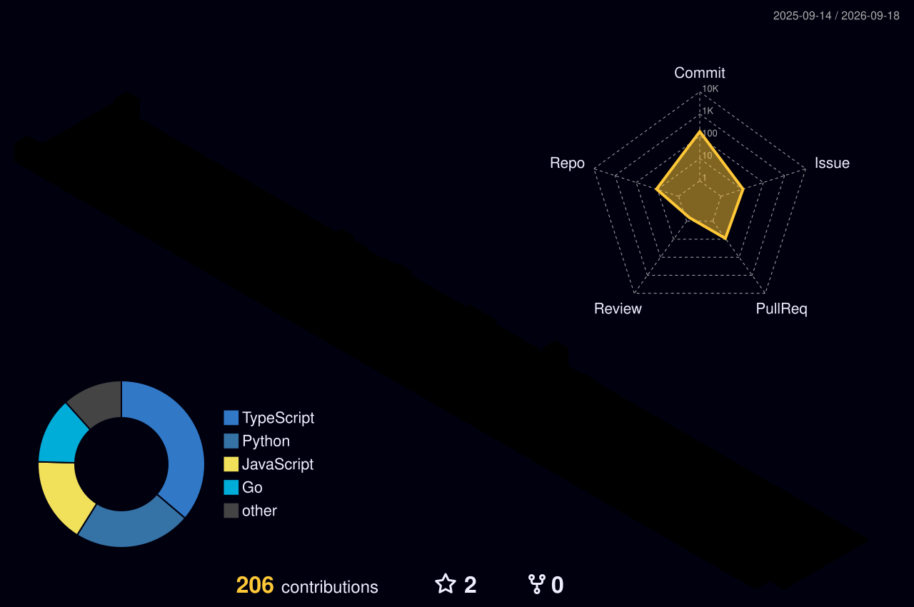

<!-- Header -->
<div align="center">


</div>

---

<div align="center">

*I don't just write code — I architect solutions, challenge assumptions,*
*and build products meant to outlast the hype.*

**Full Stack + AI Engineering. Production standard. Always.**

[](https://www.ritanshupatel.site)
[](https://linkedin.com/in/ritanshupatel)
[](mailto:ritanshupatel88@gmail.com)

</div>

---

## 🛠 Tech Stack

**Frontend**


**Backend & Cloud**


**🤖 AI Engineering**


**Data & ML**


---

## 📈 Top Languages

<div align="center">


</div>

---

## 🏙️ Contribution Graph

<div align="center">



</div>

---

## 🧭 What I'm Learning — 2025 Roadmap

```
AI ENGINEERING PATH
════════════════════════════════════════════════════════

  ✅  LangChain & RAG Pipelines          ████████████░░  90%
  ✅  Vector Databases (FAISS/Pinecone)  ██████████░░░░  75%
  🔄  LangGraph & AI Agents             ████████░░░░░░  60%
  🔄  Model Fine-tuning                 ██████░░░░░░░░  40%
  📌  AI Evaluation & Testing           ████░░░░░░░░░░  25%
  📌  Multi-modal AI Applications       ██░░░░░░░░░░░░  15%

FULL STACK DEPTH
════════════════════════════════════════════════════════

  ✅  Next.js & SSR/ISR Architecture    ████████████░░  90%
  ✅  AWS (S3, CloudFront, EC2)         ██████████░░░░  70%
  🔄  System Design at Scale            ████████░░░░░░  55%
  📌  Kubernetes & Advanced DevOps      ████░░░░░░░░░░  30%

  ✅ Done  🔄 In Progress  📌 Next Up
```

---

## 🚀 Featured Projects

| Project | Stack | What makes it different |
|---|---|---|
| [Network Integrity Assurance Platform](https://github.com/RitanshuPatelMMR) | Python · XGBoost · FastAPI · SHAP | Ensemble ML · 99.38% precision · XAI explainability |
| [Cloud Vault](https://github.com/RitanshuPatelMMR) | Next.js 15 · Appwrite · TypeScript | Sub-300ms retrieval · OTP auth · Full CI/CD |
| [Chartify](https://github.com/RitanshuPatelMMR) | React · MongoDB · Recharts | SaaS data viz · RBAC admin · CSV/Excel/JSON |

---

## 💭 Philosophy

> *"Most people wait to be assigned a problem.*
> *I find them, break them down, build the solution from scratch,*
> *ship it to production, and then look for the next one.*
>
> *Good code isn't just code that works —*
> *it's code that performs, scales, and serves a purpose.*
>
> *That mindset doesn't come from a course.*
> *It comes from refusing to be average at something that actually matters."*

---

## ⚡ Fun Facts

```javascript
const ritanshu = {
  currentlyBuilding : ["RAG pipelines", "AI agents", "things that ship"],
  favoriteDebugLine : "it works on my machine",
  codePhilosophy    : "production standard or nothing",
  whenNotCoding     : ["analyzing tech businesses", "thinking in systems",
                       "long-term investing mindset"],
  funFact           : "I analyze stocks the same way I optimize code — data-driven, long-term, scalable",
  lifeRule          : "build something real every single week",
}
```

---

<div align="center">


</div>
